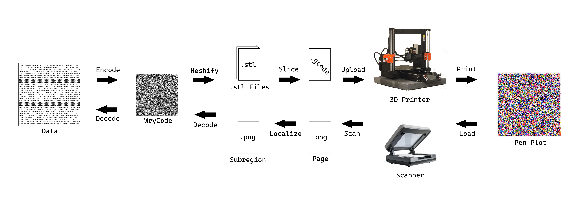
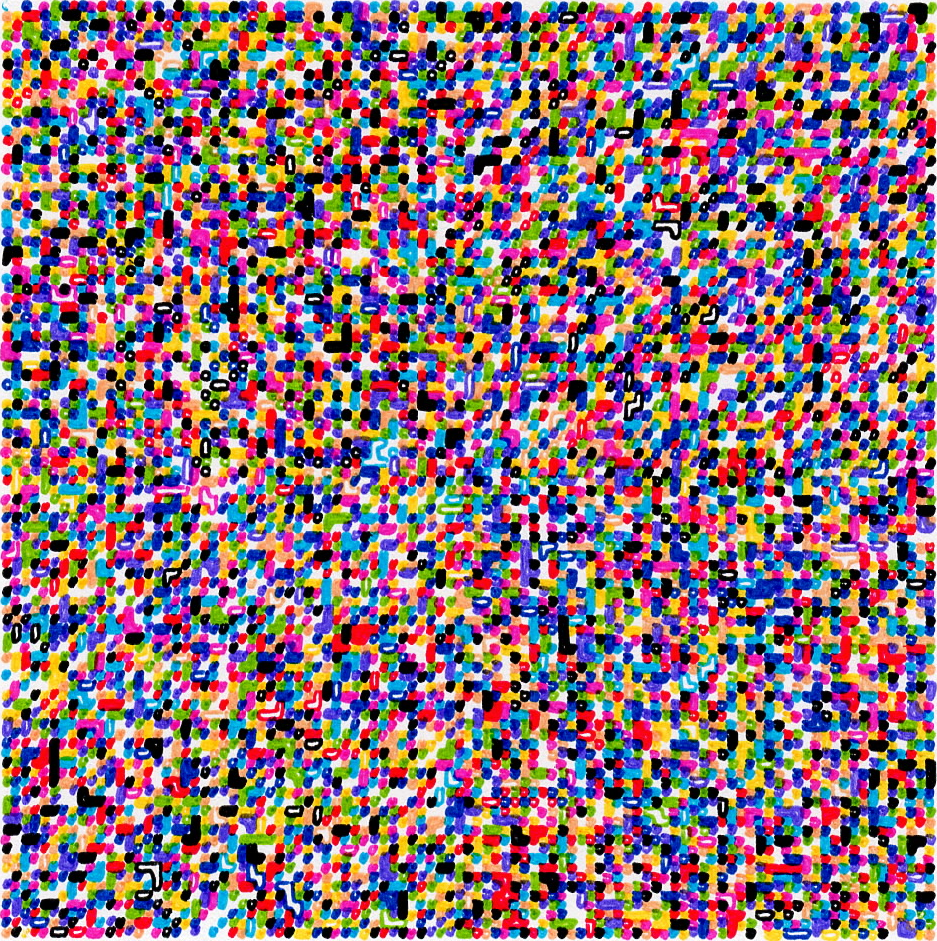
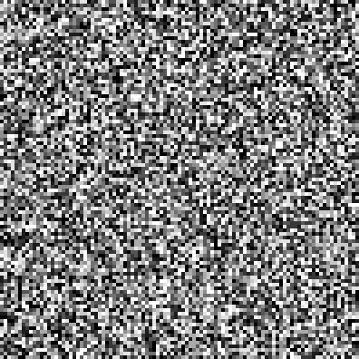
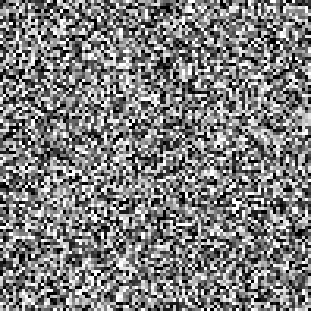

# Pen Drive

Storing data in pen.



> Workflow diagram

## Proof of Concept

### Produced Plot



> Proof of concept: ~12kb lossly stored on a sheet of cardstock.
> 80mm x 80mm plot, 10 colors, 0.8mm x 0.8mm cell size, 0.2mm resolution

### Source WryCode



> Source WryCode used to create the produced plot.

# Theory

### Encoding

```
Data -(convert)-> .STLs -(slice)-> .gcode -(plot)-> Plot
```

1. Incoming data is converted into channel-specific STLs.
2. STLs are sliced into gcode and plotted into a specific area of paper.

### Decoding

```
Plot -(scan)-> scan.jpg -(convert)-> Data
```

1. Plot is scanned into an image.
2. Image is converted into data.

### Density

The storage density of pen drive is determined by the following factors:

1. Number of colors
2. Size of the plot
3. Size of each cell
4. Error correction coding

#### Example Calculation 1:

```
Colors = 10
Plot Size = 181mm x 206mm
Cell Size = 0.5mm x 0.5mm

Cells = 181 / 0.5 * 206 / 0.5
      = 362 * 412
      = 149,144 cells

Storage = cells * colors
        = 149,144 * 10
        = 1,491,440 bits
        = 186,430 bytes
        = 186.43 KB
```

#### Example Calculation 2:

```
Colors = 10
Plot Size = 80mm x 80mm
Cell Size = 0.8mm x 0.8mm

Cells = 80 / 0.8 * 80 / 0.8
      = 100 * 100
      = 10,000 cells

Storage = cells * colors
        = 10,000 * 10
        = 100,000 bits
        = 12,500 bytes
        = 12.50 KB
```

# Implementation

### Encoding

`numpy-mesh-full.py` generates random data, saves it to `image.png`, and converts the image into a its component `.stl` files.


> plot 80mm x 80mm, 10color, cell 0.8mm x 0.8mm @ 0.2mm resolution

```
/ 0.stl
/ 409.stl
/ ...
/ 4090.stl
```

PrusaSlicer is used to convert the STLs into gcode.

In a past project, I made a mounting system for attaching things to my Prusa MK4S+ 3d printer. I'm making make use of it here with the g2 adapter and the provided base 3mf settings file: [https://www.printables.com/model/1788386-nextruder-toolholder](https://www.printables.com/model/1788386-nextruder-toolholder).

The base 3mf file includes all the settings and logic needed to make doing a multi-color plot as simple as possible. Modified start sequence, gcode automatically pauses between parts.

`NTH 80mm x 80mm x 10color.3mf` contains the 10 STLs combined into a single 3mf file. One can select to reload the imported files to persist updates to image.png.
