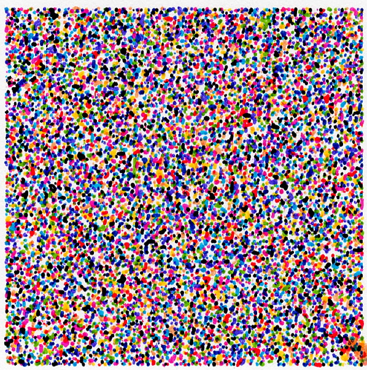

# Wryre (Pen Plot as a Storage Medium)



> 18.7kb lossly stored on a 50mm x 50mm sheet of paper, via a Prusa MK4S+ with 10 colors.

# Theory

#### Encoding

```
Data -(convert)-> .STLs -(slice)-> .gcode -(plot)-> Plot
```

1. Incoming data is converted into channel-specific STLs.
2. STLs are sliced into gcode and plotted into a specific area of paper.

#### Decoding

```
Plot -(scan)-> scan.jpg -(convert)-> Data
```

1. Plot is scanned into an image.
2. Image is converted into data.
